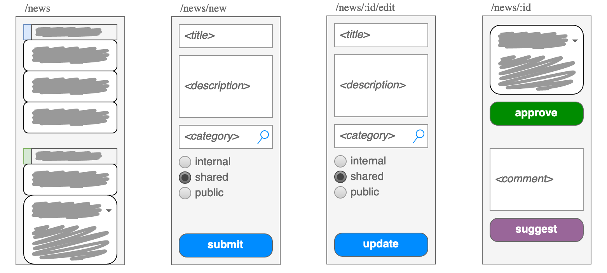

title: churnal: Digestible News
tags: collaboration
author: FND
created: 2022-09-02

```intro
In ruminations on how async-first communication could and should work within a
rapdily growing team, I had concluded that unidirectional broadcasting of
significant developments can provide tremendous value, if done well.
```

I'm occasionally reminded of this and still believe it could prove useful in
other contexts -- so it seems worth writing down: Below is a version of what I'd
proposed to the team at the time.

Lately, I've come to appreciate [ORF's news feed](https://news.orf.at) (works
best on _small_ viewports 🙃 ) as a comparatively simple/efficient/unobtrusive
way to get a sense of the world: a single no-frills page with concise headlines
and a low-friction mechanism to reveal brief descriptions.

Something similar might be useful for teams to
[casually keep each other informed](https://en.wikipedia.org/wiki/Ambient_awareness)
without having to invest significant energy/time -- which includes avoiding the
trap of turning everything into a discussion, as often happens with chat and
microblogging.

Fairly simple tooling could allow everyone to post a news item, with the
explicit goal of keeping things concise -- though without having to write an
elaborate article every time; shared context would develop over time. Naturally,
categories (or tags) could be used for grouping; that seems to work quite well
for ORF there.

I imagined this to look somewhat like this:



Note that this mock-up implies an approval queue: The idea was to encourage and
_teach_ each other to really be concise, much like journalists/editors certainly
do at ORF.

A [simplistic prototype](./churnal.html) helped me get a better sense of what it
might feel like. Using somewhat realistic content (obfuscated in this version)
was particularly helpful; indeed, it already confirmed _to me_ that this kinda
aggregation could be very beneficial.

I then turned this into something extensible, based around simple Markdown files
and auto-published via GitLab Pages -- the idea being that entries are
added/modified via merge requests, generating a single HTML file. That way we
didn't need an interactive server, plus this should also encourages peer review
before publication, as described above.

Effectively, all I did was create a tiny static-site generator (a foray into
[Deno](https://deno.land) territory) and, arguably, reinvent
[feeds](https://aboutfeeds.com). The more important lesson though was the
importance of good journalism (for lack of a better term) in non-trivial
collaboration.
