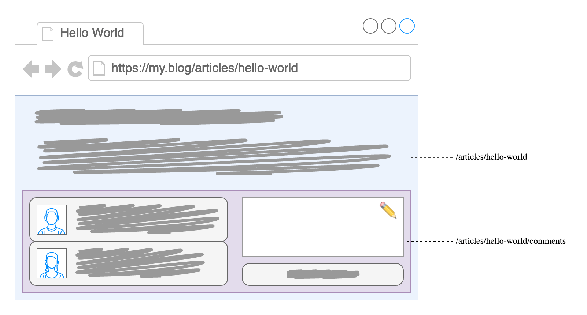
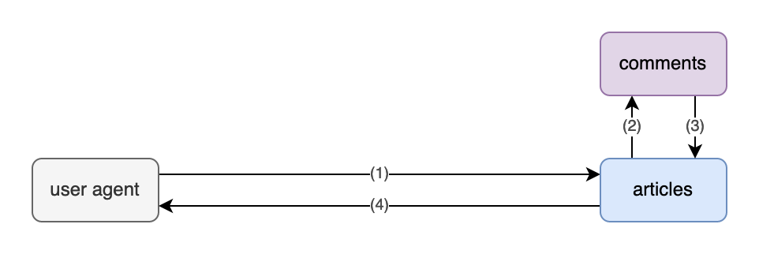
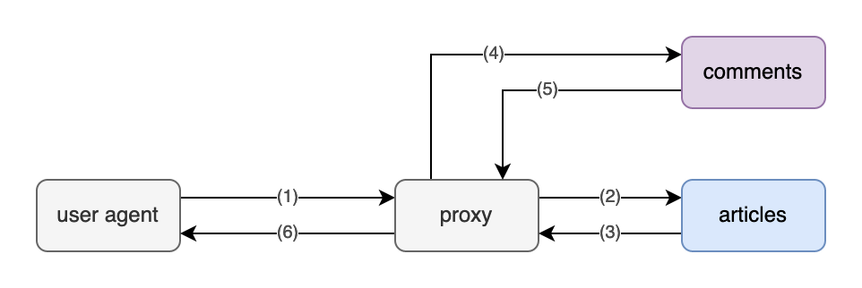
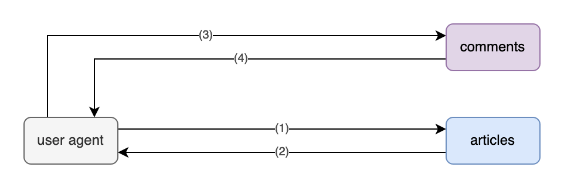

title: Seizing the Means of Transclusion
tags: web
author: FND
created: 2022-11-03
syntax: true
_origin_: https://gist.github.com/FND/c7ab10f49bcd6236ab42f1fce9ebe1f5

```intro
After years of advocating transclusion as a simple and effective integration
mechanism, we've identified patterns and pitfalls worth considering.
```

Even before popularizing [Self-Contained Systems](https://scs-architecture.org),
INNOQ and friends have been
[championing transclusion](https://www.innoq.com/en/blog/transclusion/) as a
simple and effective integration mechanism between web applications: Embedding
HTML snippets generated by another system means we can delegate responsibility
for content without relying on complex API
contracts.[transclusion-contract](footnote://) (We did not, of course,
[invent transclusion](https://en.wikipedia.org/wiki/Transclusion#History_and_implementation_by_Project_Xanadu).)

```footnote transclusion-contract
Exchanging HTML means there's no need for both sides to agree on a data model
which is then interpreted and transformed by the receiving side. Instead the
provider's markup is inserted more or less verbatim (modulo
[sanitization](https://en.wikipedia.org/wiki/HTML_sanitization)). That
of course implies trusting the provider to not send unexpected garbage.
```

We've since become a little more wary of this technique, as we've seen it being
used excessively and turn into a footgun, not least when it comes to front-end
components and their dependencies. Nevertheless, when used wisely -- which often
means imposing strict limits on what qualifies as transcludable markup (in
other words, establishing an explicit contract) -- it can be a very powerful
tool.


Enterprise-Scale Blogging
-------------------------

Perhaps [your blog](https://cagrimmett.com/thoughts/2022/04/26/why-blog/)
allows people to leave comments. You might decide to split articles and
comments into separate resources (as in URLs) in order to
[optimize caching](page://articles/http-caching) as comments tend to be more volatile.
Those resources might even be provided by two independent applications, to
account for different requirements (think authentication, moderation etc.) or
varying request load. With responsibilities divided that way, you could rope in
a friend to manage comments for your clique's web ring while you focus
exclusively on serving static files generated from Markdown.



If you're more the commercial type, imagine a product page with recommendations
for similar items -- or perhaps a shopping cart accompanying you across multiple
pages. Administrative folks might picture their inbox being augmented by a
calendar on the side, delighted by an unread counter haunting their documents'
navigation bar. That bar at the top might also include their user profile -- all
drawn from dedicated resources.


Rehabilitation
--------------

We've split our system into separate parts, for purely technical reasons. Now we
need to recombine those distinct resources into a single page, seamlessly if
possible: End users shouldn't have to care about about our internal system
boundaries.

Transclusion makes this possible without complex orchestration: Primary content --
our article -- contains placeholders where secondary content -- vistors'
comments -- should appear.[content-classification](footnote://) Any such
placeholder points to the respective URL, which is then resolved -- or
"dereferenced"; replacing the placeholder with the corresponding content. In our
case that's HTML representing comments, if any, and conceivably including an
HTML form to submit a new comment.

```footnote content-classification
The distinction between primary and secondary content is typically a
domain-specific judgment call. Generally speaking, primary content comprises
anything essential while secondary content can be considered supplementary. In
other words, if the latter happens to be unavailable, users can still get value
from the former.
```


Implementation Options
----------------------

Of course that leaves the question: Who is gonna do the dereferencing,
retrieving secondary content and swapping out the placeholder? Given we're in a
client-server environment, there are a few options: The client, the application
server (AKA "origin server") or an intermediary, i.e. some sort of proxy server.


Our blog system (_articles_ beneath) could integrate comments directly:



Alternatively, we might delegate that task to a proxy under our control:



Or we just leave it to clients:



Arguably, the most straightforward way for an application to indicate
placeholders would be to generate a regular old link and leave transclusion to
some other part of the chain:

```html
<h1>Hello World</h1>
<p>…</p>
<a class="is-transcludable" href="/articles/hello-world/comments">comments</a>
```


### Client-Side

Assuming we're targeting web browsers, a bit of JavaScript (e.g.
[h-include](https://github.com/gustafnk/h-include) or
[embeddable-content](https://github.com/FND/embeddable-content), possibly even
just
[iframes](https://developer.mozilla.org/en-US/docs/Web/HTML/Element/iframe))
could then hook into that, retrieve the corresponding content and replace the
link. Error handling is pretty straightforward: If transclusion fails (e.g. due
to network issues, including timeouts, or because JavaScript is unavailable),
we can just leave the link right there. Typically that's still better user
experience than failing outright; transcluding secondary content can be thought
of as a progressive enhancement. Of course we could implement more elaborate
error handling if warranted, perhaps explaining why the respective content is
currently unavailable.

However, relegating transclusion to the client might have undesirable
consequences: Secondary content might flicker into existence,
[FOUC](https://en.wikipedia.org/wiki/Flash_of_unstyled_content)-style, as the
link is rendered first and replaced afterwards. Also, making every single
client request both resources might be inefficient and increase server load: If
secondary content is
[publicly cacheable](https://developer.mozilla.org/en-US/docs/Web/HTTP/Headers/Cache-Control#public)
(which, among other things, excludes personalized content and anything
requiring authentication), moving transclusion to the server side potentially
reduces the number of requests quite
significantly.[request-caching](footnote://)

```footnote request-caching
If two clients request the same article, in the scenario above that makes four
requests (2 × article + 2 × comments). If secondary content can be stored in a
shared cache for one minute and both clients visited the page within that time
frame, we could reduce that to three requests if comments were cached on the
server side and the result distributed to all clients (2 × article + 1 ×
comments). With 100 clients, that's 200 vs. 101 requests per minute.
```


### Server-Side

For that we could use
[Server Side Includes](https://en.wikipedia.org/wiki/Server_Side_Includes)
(SSI) within a **proxy server**, such as Apache or nginx. Unfortunately we
can't use a regular link there, as SSI -- for
[lack of a common standard](https://chriscoyier.net/2022/10/20/isnt-it-weird-there-is-no-standards-based-declarative-way-to-put-a-chunk-of-html-inside-other-html/) --
prescribes its own syntax:

```html
<!--# include virtual="/articles/hello-world/comments" -->
```

SSI is widely supported, but it comes with significant flaws -- most notably
severely limited error handling[error-handling](footnote://). Debugging can also
be very painful.
[Edge Side Includes](https://en.wikipedia.org/wiki/Edge_Side_Includes) (ESI)
are similar and address some of those flaws, though support is a little more
spotty: While SSI can often be enabled on an existing reverse proxy, ESI
typically needs a separate installation.

```footnote error-handling
With server-side transclusion, it's often a good idea to bake in static fallback
content at build time, which can be used if and when transclusion fails at
runtime.
```

Many CDNs have more powerful scripting facilities for
[manipulating outgoing HTML](https://developers.cloudflare.com/workers/runtime-apis/html-rewriter/),
allowing for pretty much the same flexibility as with client-side JavaScript.
Some even support
[streaming HTML](page://articles/streaming-html), which can provide a huge
performance boost.

Various [companies](https://github.com/zalando/tailor) and
[individuals](https://twitter.com/wcbytes/status/1541546418539732997) have
rolled their own solutions, with sometimes frightening complexity. The
rationale there is sometimes to avoid slowing things down: We don't want
primary content to be blocked while retrieving secondary content. (That's
something we get for free with the client-side approach.)

Lastly, while implementing **transclusion within our application** might appear
simple at first, it often turns out to be tricky: Correctly managing HTTP
requests and caching is not trivial. It also puts additional strain on the
origin server.


Conclusion
----------

We should be very conscious of when and how we employ transclusion. As with all
distributed systems, adequate error handling should be built in from the start.
Server-side transclusion can be thought of as an optimization, which works best
with highly cacheable content, at the cost of increased infrastructure
complexity. It might be perfectly sensible to use both client-side and
server-side transclusion within the same application, depending on the use
cases.
